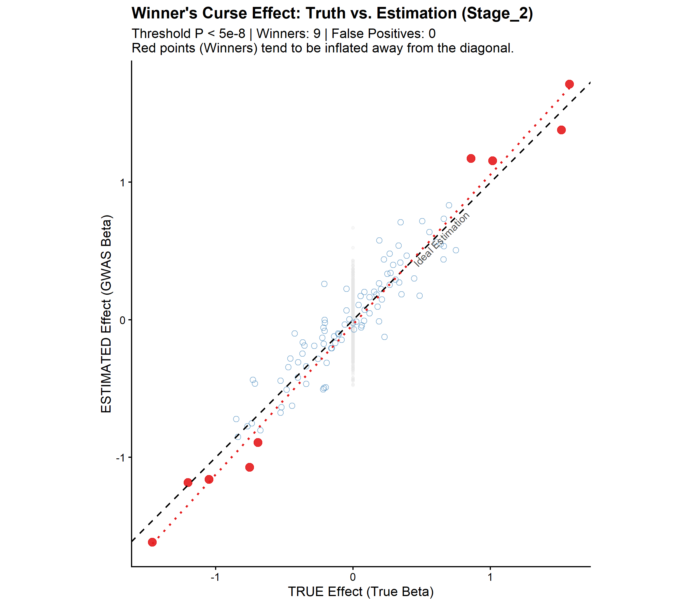
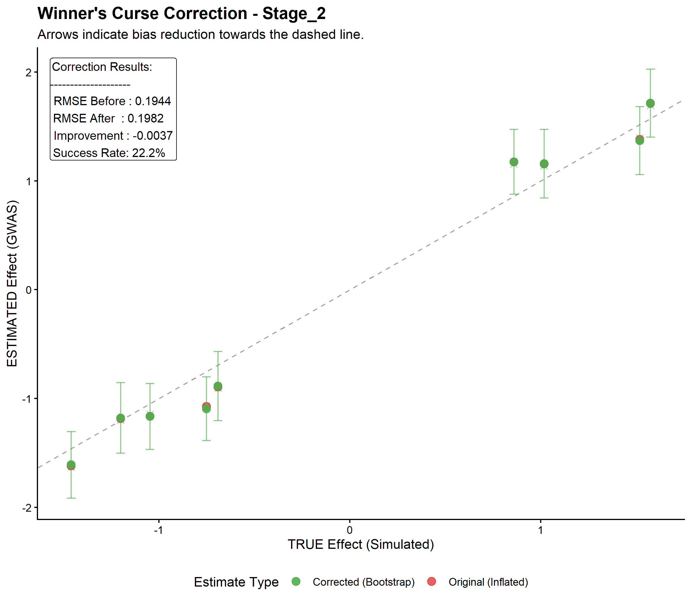

# WinnerBias: Análisis y Simulación del "Winner's Curse" en GWAS

Este repositorio contiene el código fuente y los resultados del trabajo de la asignatura **Programación y Estadística en R**, del **Máster en Bioinformática y Biología Computacional (UAM)**, dedicado al estudio del sesgo de selección (**Winner's Curse**) en Estudios de Asociación de Genoma Completo **(GWAS)**.

El proyecto implementa un **motor de simulación completo en R** que permite generar cohortes sintéticas, ejecutar GWAS vectorizados y evaluar estrategias de corrección (Bootstrap) bajo distintos escenarios de potencia estadística.

---

## 📋 Descripción del Proyecto

El **Winner's Curse** ocurre cuando las variantes genéticas seleccionadas por su significación estadística ($p < 5 \times 10^{-8}$) muestran efectos sistemáticamente inflados respecto a su valor real, especialmente en estudios con baja potencia.

Este proyecto tiene tres objetivos principales:
1.  **Simular** escenarios realistas de GWAS con parámetros biológicos controlados.
2.  **Cuantificar** la magnitud del sesgo en función del tamaño muestral.
3.  **Evaluar** la eficacia del método *Bootstrap Bagging* para corregir dicha inflación.

---

## 🏗️ Estructura del Repositorio

El proyecto sigue una arquitectura modular y dinámica:

```text
WinnerBias/
├── R/                          # Funciones base (Backend)
│   ├── sim_genetics.R          # Generación de fenotipos y genotipos
│   ├── gwas_engine.R           # Regresión lineal vectorizada (GWAS)
│   ├── statistical_power.R     # Cálculos teóricos de potencia
│   └── bootstrap_correction.R  # Algoritmo de corrección
│
├── analysis/                   # Scripts de Análisis
│   ├── run_experiment_batch.R  # SCRIPT MAESTRO (Ejecuta todo el pipeline)
│   └── Stage_2/                # Plantillas de ejecución paso a paso
│       ├── 1.0_power_calculation.R
│       ├── 1.1_generate_datasets.R
│       ├── 1.2_run_gwas.R
│       ├── 1.3_plot_results.R 
│       ├── 1.4_check_bias.R
│       └── 1.5_correct_bias.R
│
├── data/                       # Datos simulados (.rds)
└── output/                     # Resultados


    ├── figures/                # Gráficos generados
    └── Stage_X/                # Reportes de métricas (.csv)
```
---

## ⚙️ Escenarios Experimentales

El sistema orquesta automáticamente **tres escenarios** para demostrar la aparición del sesgo.

Para aislar el efecto del tamaño muestral, se mantiene constante la arquitectura genética en todos los casos (1000 SNPs, 100 causales, herencia $h^2=0.5$).

| Escenario | Muestra ($N$) | Potencia | Objetivo |
| :--- | :---: | :---: | :--- |
| **Stage 0** | 50,000 | Alta (>99%) | **Control Positivo** (Estimación ideal) |
| **Stage 1** | 7,000 | Media | Transición |
| **Stage 2** | **2,000** | **Baja (<20%)** | **Simulación del Winner's Curse** |

## 🚀 Instrucciones de Uso

Todo el flujo de trabajo está centralizado en un único punto de entrada para garantizar la reproducibilidad.

### 1. Requisitos
Este proyecto utiliza paquetes estándar de R para manipulación de datos y gráficos. Asegúrate de tener instalados:

```r
install.packages(c("dplyr", "ggplot2", "knitr"))
```

### 2. Ejecución

Para replicar los resultados de los 3 escenarios, simplemente ejecuta el script maestro:


```r
# Desde la raíz del proyecto
source("analysis/run_experiment_batch.R")
```

Este script se encargará automáticamente de:

1. Cargar **parámetros** para cada Stage.

2. Llamar secuencialmente a los **scripts** modulares (1.0 a 1.5).

3. Generar los **gráficos** y **CSVs** en la carpeta output/.


## 📊 Resultados Destacados

Los resultados visuales confirman la hipótesis inicial sobre el comportamiento del sesgo en función de la potencia estadística.

### 1. Evidencia Visual del Sesgo (Stage 2: N=2.000)

En escenarios de baja potencia, el **Winner's Curse** se hace evidente visualmente al comparar el efecto real (Eje X) frente al efecto estimado por el GWAS (Eje Y).

* **Los "Winners" (Puntos Rojos):** Son las variantes que superaron el umbral de significación ($p < 5 \times 10^{-8}$). Como se observa en la gráfica, estos puntos **flotan sistemáticamente por encima de la línea diagonal** punteada (identidad).
* **Interpretación:** Esta desviación visual demuestra la **sobreestimación** del efecto. El GWAS "cree" que estas variantes tienen un impacto mayor del que realmente tienen biológicamente.



### 2. Evaluación de la Corrección (Bootstrap)

Se aplicó un algoritmo de corrección basado en **Bootstrap Bagging** para intentar mitigar el sesgo observado en los winners del Stage 2.

* **Resultado Negativo:** Contrario a lo esperado teóricamente, en condiciones de potencia tan extrema ($N=2.000$), el remuestreo **no logra corregir el sesgo de forma efectiva** e incluso puede aumentar la varianza en ciertos casos.
* **Conclusión Científica:** Este resultado subraya una limitación crítica: las técnicas estadísticas de corrección interna no pueden hacer magia. Cuando la señal original es casi indistinguible del ruido ("Garbage in"), el bootstrap no puede recuperar la información perdida, confirmando la necesidad absoluta de la **replicación externa** en cohortes independientes.



## ⚠️ Limitaciones y Trabajo Futuro

Este estudio demuestra que, en condiciones de potencia extremadamente baja ($N=2000$), las correcciones internas como el Bootstrap son insuficientes para recuperar el efecto biológico real. La señal queda tan diluida en el ruido que el remuestreo no logra distinguir eficazmente la inflación del efecto verdadero.

**Líneas futuras de investigación:**

* **Replicación Externa:** La solución "gold standard". Validación de los candidatos descubiertos en una cohorte independiente (Stage 3 proyectado) para filtrar falsos positivos.
* **Métodos Avanzados:** Implementación de correcciones más sofisticadas como **FIQT** (Winner’s Curse correction via FIQT, *Forde et al.*) o aproximaciones **Bayesianas** (Empirical Bayes).
* **Impacto en PRS:** Evaluación de cómo esta inflación de los efectos distorsiona el cálculo de los *Polygenic Risk Scores* (PRS) y afecta a su capacidad predictiva en pacientes reales.

## ✒️ Autores

* **Daniel Gutiérrez Álvarez**
* **Gabriel Reinoso Calderón**
* **Rodrigo Barber Murga**
